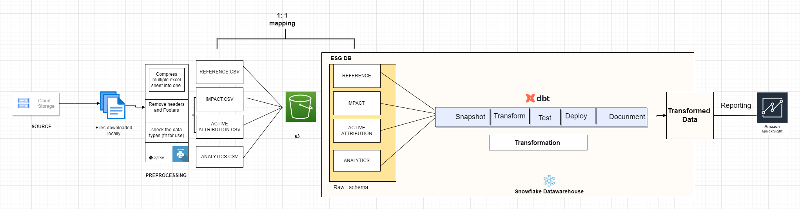

# Environmental,Sustainability,Governance Analytics Engineering Project

This is an end-to-end Data Analytics Engineering that seeks to provide readily available data in the Snowflake datawarehouse for Analysis and Monitoring purposes. 

## Solution Implementation
In order to effectively implement the solution
- Business requirements was properly studied,
- Data mapping Document was created.

Based on the business requirements here were the steps taken, to exceute the solution.
- Source - GCP Cloud storage
- Python scripts to unzip the extracted data
- Data Cleaning - Removing headers and footers, validate the data types for each columns and rename it does not conform to the data mapping document standards, these steps are done  across multiple excel sheets using python scripts.
- Preprocessed data are stored in a Data Lake (AWS S3 bucket) for data Quality control.
-  The structured data are moved to the Snowflake datawarehouse and stored in the ESG-schema warehouse.
- Data transformation is done on the data using DBT (Data build tool) and data lineage and data docunmentation is provided for reporting and Analysis purposes.

## Tech Stack

**Programming Languages:** Python, SQL, JINJA

**Data Transformation:** DBT 

**Data Warehouse:** Snowflake

**Data Lake:** AWS S3

**Data Visulisation :** AWS Quicksight, Grafana 

